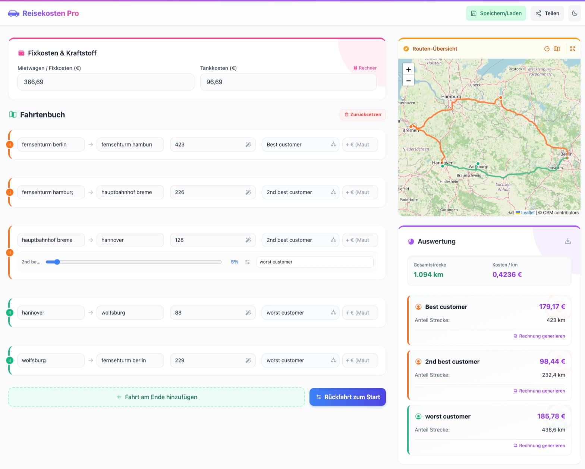
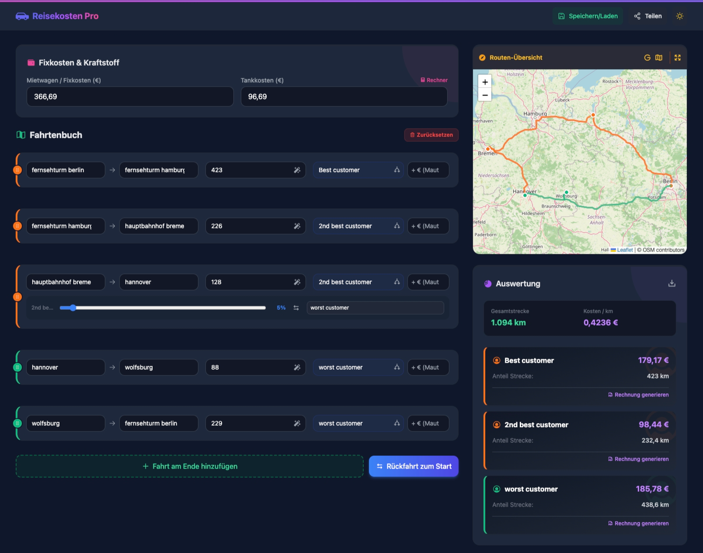

# 🚗 Reisekosten Pro (Rental Expense Tracker)

A modern, fast, and fully client-side web application for tracking rental car expenses, calculating travel distances via interactive maps, breaking down costs by client, and generating professional invoices.

  
  

[**📖 Read the full Technical Documentation here**](docs/documentation.md)

## ✨ Features

- 🗺️ **Interactive Map Integration:** Visualizes your routes on an interactive map using Leaflet and OpenStreetMap.
- 📏 **Distance Calculation:** Automatically calculates distances and routes between locations (using Photon/Nominatim and OSRM APIs).
- 💶 **Expense Management:** Track fixed rental costs and dynamically calculate gas costs based on fuel consumption and prices.
- 🏢 **Client Breakdown:** Automatically splits and assigns costs to different clients based on traveled distances.
- 📄 **Invoice Generation:** Generate ready-to-print or PDF-exportable invoices for specific clients right from the app.
- 💾 **Local Storage:** Securely save and load your trips, settings, and addresses locally in your browser.
- 🌙 **Dark Mode:** Fully supports both light and dark themes for optimal viewing.
- 📱 **Responsive Design:** A beautiful UI built with Tailwind CSS, working seamlessly on both desktop and mobile devices.

## 🚀 Setup & Installation

This is a completely standalone frontend application requiring no backend or build steps.

1. Clone or download the repository.
2. Open `index.htm` in any modern web browser.
3. Start tracking your expenses!

## 📖 Usage

1. ⛽ **Fixkosten & Kraftstoff:** Enter your base rental cost and use the built-in calculator to estimate your gas costs based on your car's consumption and current fuel prices.
2. 🛣️ **Fahrtenbuch:** Add your trips by specifying the origin, destination, and client. You can drag and drop to reorder trips.
3. 📊 **Auswertung:** View the automatic cost breakdown per client.
4. 🧾 **Rechnungsvorlage:** Click on the generated invoice buttons in the client breakdown to view and print invoices.

## 🛠️ Technologies Used

- [HTML5 / Vanilla JavaScript](https://developer.mozilla.org/en-US/docs/Web/JavaScript)
- [Tailwind CSS (via CDN)](https://tailwindcss.com/)
- [Leaflet.js](https://leafletjs.com/) for interactive maps
- [Phosphor Icons](https://phosphoricons.com/)

## 📜 License

This project is licensed under the MIT License - see the [LICENSE](LICENSE) file for details.
